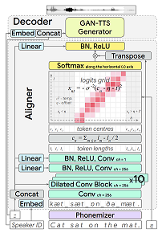

# EETS
A pytorch implementation of the EETS: End-to-End Adversarial Text-to-Speech (https://arxiv.org/pdf/2006.03575.pdf)

## Attention
* I only implemented the preliminary framework.
* In my opinion, the training cost of EETS is very expensive. Maybe we can consider using ground truth duration during training process and introduce additional auxiliary loss to accelerate convergence.
